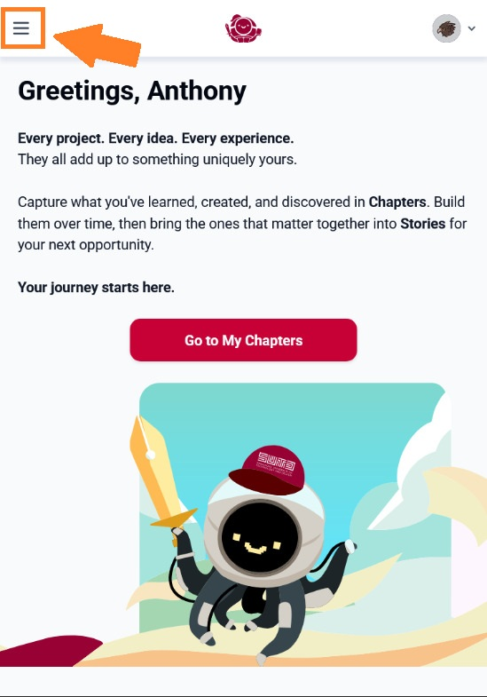
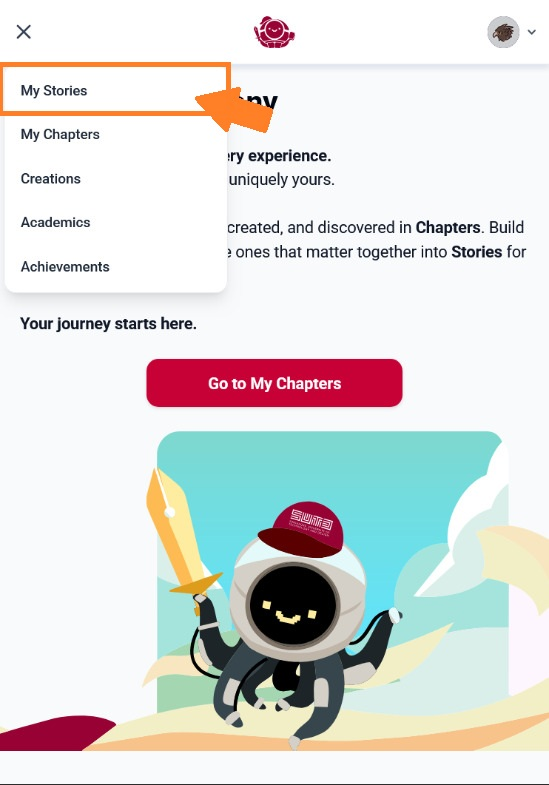

# My Stories

A Story is a collection of Chapters chosen for a particular audience. Bring together the experiences that help someone understand your interests, strengths, or next direction.

One Chapter can belong to several Stories. Updates to that Chapter are shared across those Stories; use a separate copy if you need different content.

## Find My Stories

On a desktop, select **My Stories** in the top navigation.

<figure><figcaption>Select My Stories in the top bar.</figcaption></figure>

On a smaller screen, open the menu at the top left, then select **My Stories**.

<figure><figcaption>Open the navigation menu.</figcaption></figure>

<figure><figcaption>Select My Stories from the menu.</figcaption></figure>

## Choose your next step

- [Select a Story](selecting-a-story-to-work-on.md).
- [Create a Story](creating-a-story.md).
- [Customise its header](customising-a-storys-header.md).
- [Add and arrange Chapters](managing-chapters-inside-a-story.md).
- [Publish and share](publishing-and-sharing-a-story.md).

**Journey tip:** Start with the person who will read your Story. A few well-chosen Chapters can make your message clearer.
