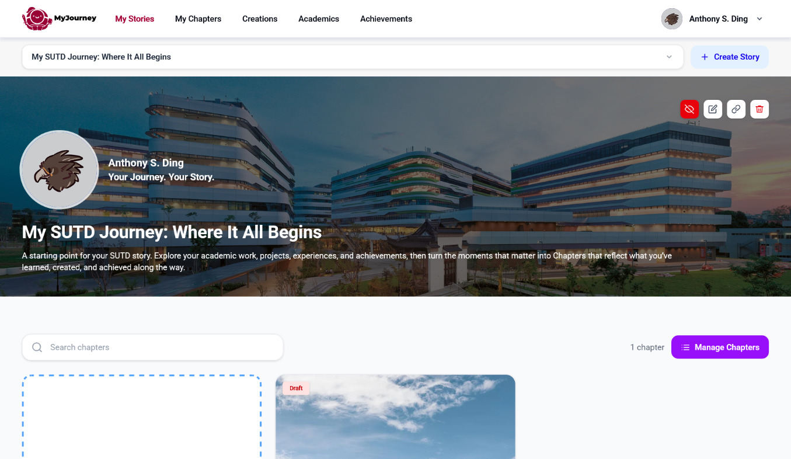

# My Stories

**My Stories** turns your experiences into clear, meaningful narratives for the people you want to reach. A 'Story' is a collection of meaningful chapters that you personally curate to better tell a particular story to a particular audience.

### Navigating to My Stories (Web)

To navigate to My Stories, you can click on the top navigation bar:

<figure><figcaption></figcaption></figure>

### Navigating to My Stories (Mobile)

Or under the hamburger icon menu: (if you're accessing it from smaller screen sizes, e.g. mobile view)

<figure><figcaption></figcaption></figure>

and then click on My Stories

<figure><figcaption></figcaption></figure>

### 'My Stories' tab overview

You'll see this page once you have navigated in

<figure><figcaption></figcaption></figure>


Curating your story is a lot easier if you have previously created some chapters in [my-chapters](../my-chapters/ "mention")! That's why MyJourney team highly encourage you to take a small, but consistent and frequent step to clarify the story of your life, one chapter at a time!


Then reuse and arrange them for a specific audience. Your experiences stay yours. The story changes with the opportunity.

### Make each story feel right

Choose the chapters that show what matters most. Add a clear title. Keep the focus on the message you want someone to remember.

For example, you could create:

* **Portfolio for employers** — projects, skills, and results that show how you work.
* **Finding my passion** — key moments that led you towards a field or cause.
* **Exchange application** — experiences that show curiosity, adaptability, and cultural openness.
* **Internship introduction** — relevant learning, teamwork, and goals for your next step.
* **My leadership journey** — times you guided a team, started something, or made change happen.
* **From challenge to growth** — setbacks that taught you resilience and new skills.

One chapter can belong in many Stories. A group project may show teamwork for an internship. The same project may show creativity in a portfolio. Pick the angle that fits your audience.


Fab.io’s tip: keep each Story focused. A few strong chapters tell a clearer story than everything at once.


### A simple way to begin

1. Think about who will read your Story.
2. Decide what you want them to understand about you.
3. Select the chapters that make that message shine.

Your journey has many sides. My Stories helps you share the right one, at the right time.
